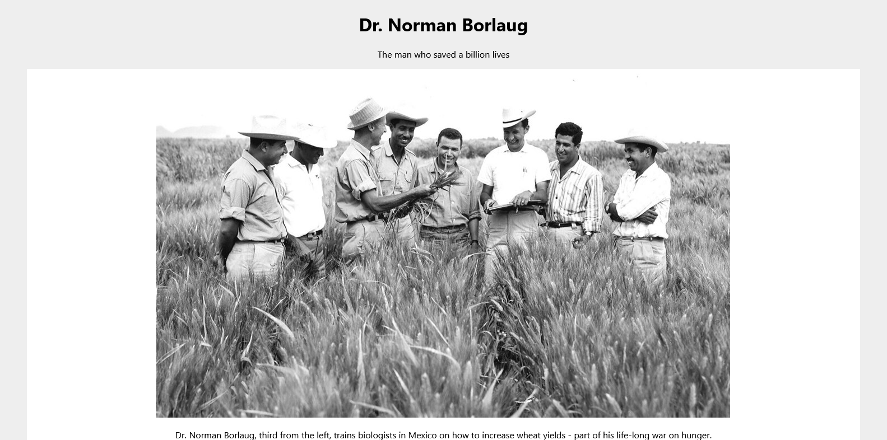
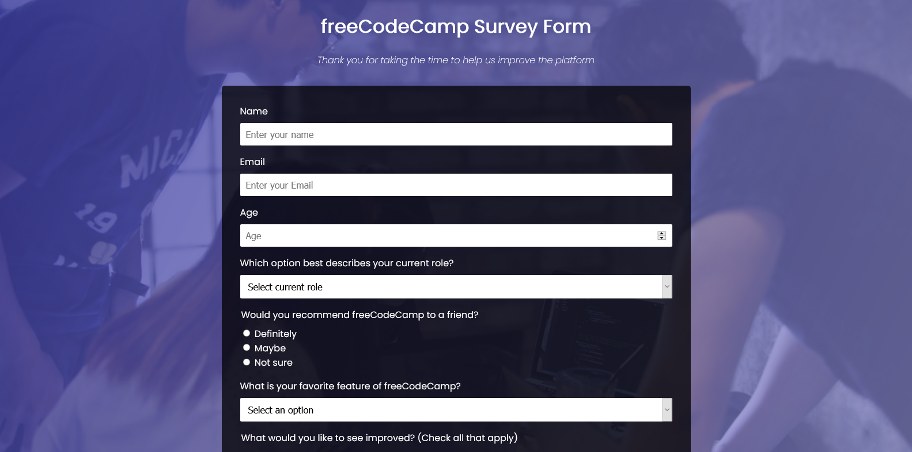
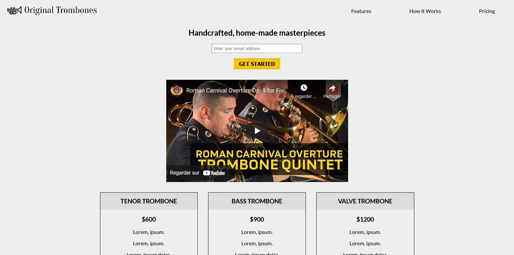
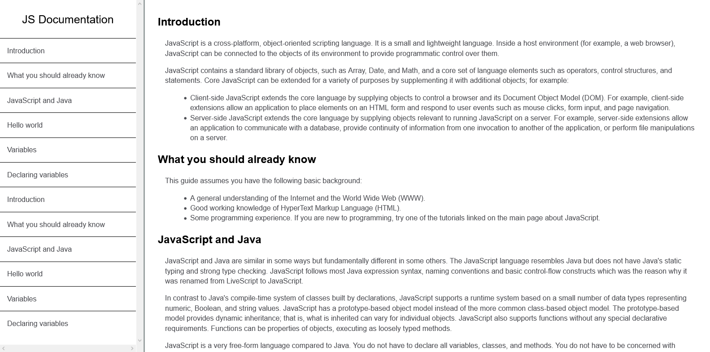
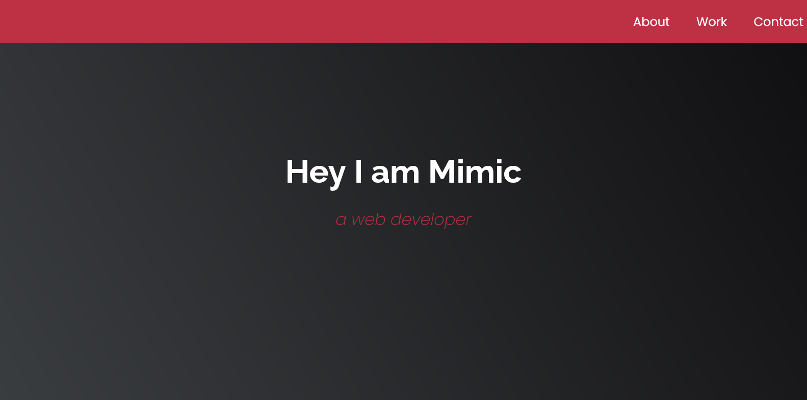

# FreeCodeCamp - Responsive Web Design

Here is the projects I realised for the [Respnsive Web Design](https://www.freecodecamp.org/learn/responsive-web-design/) course of [FreeCodeCamp](https://www.freecodecamp.org/).

## Tribute Page

_Notion: Basic HTML - CSS_

## Survey Form 

_Notion: Basic Form_

## Product Landing Page

_Notion: Flex Box_

## Technical Documentation 

_Notion: Media Queries and sticky navbar_

## Personal Portfolio

_Notion: Grid_

